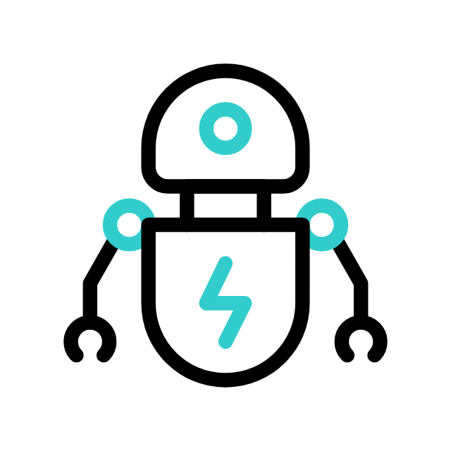

# dash-yada  


__`dash-yada` lets you easily create interactive tutorials for your Dash app.__


### Installation

---

```bash
$ pip install dash-yada
```

<br>
<br>

### Live Demo

---

Check out the [Live Demo](https://dashyada.pythonanywhere.com/) to see dash-yada in action!

See the [code](https://github.com/BSd3v/dash-yada/tree/dev/docs/demo) for this demo in the /docs folder.


<br>
<br>

### More Examples

---

See more examples in the [/examples](https://github.com/BSd3v/dash-yada/tree/dev/docs/examples) folder

<br>
<br>


### Quickstart  

---

To get started, simply add the `Yada()` component to the app's layout. 
You will see the Yada image, in the top right corner.  On hover, it displays a default welcome message.


```python
import dash
from dash import html
import dash_bootstrap_components as dbc
from dash_yada import YadaAIO

app = dash.Dash(__name__, external_stylesheets=[dbc.themes.BOOTSTRAP])

app.layout = dbc.Container(
    [
        YadaAIO(yada_id="yada"),
        html.H4("My Dashboard", className="p-3 bg-primary text-white text center"),
    ],
    fluid=True,
)

if __name__ == "__main__":
    app.run_server(debug=True)

```

The default yada image is from [Flaticon.com](flaticon.com).  If you use this image, please include an [attribution.](https://www.flaticon.com/free-animated-icon/robot_9066203?term=robot&page=1&position=2&origin=search&related_id=9066203)

<br>
<br>

### Customizing the Yada image

-----

Use the following props to change the yada image and the hover message:

- `yada_src` (string; optional): Location src of the yada image.

- `hover_message_dict` (dict; optional): Props to display for the message when yada is not clicked and not playing a script.
    - The `hover_message_dict` has keys:
    - `name` (string; optional) The default name is "yada".  If `name` is `""` a header is not displayed.
    - `greeting` (string; optional) If `greeting` is `""` the default greeting is not displayed.
    - `style` (dict; optional) Sets the style of the hover message card.
        
- Set the initial position and size with CSS:

The default CSS for the Yada image when the app starts is:
```css
.yada.sleeping {
    right: 30px;
    top: 5px;
    height: 50px;
    width: 35px;
}
```


```python

yada_img = "https://user-images.githubusercontent.com/72614349/236646464-1471e596-b234-490d-bf84-e2ef7a63b233.png"
hover_message_dict = {
    "name": "Hedwig",
    "greeting": "Let's explore! Just pick a tour and we'll get started",
    "style": {"backgroundColor": "lightgreen"}
}

yada = YadaAIO(yada_id="my_yada", yada_src=yada_img, hover_message_dict=hover_message_dict)


```

 
<br>
<br>


### Adding scripts  

---

You can add one or more scripts for the user to select the tour.

Yada navigates by CSS selector, so it can go to any element on a page.  Learn more about selectors at [Mozilla web-docs](https://developer.mozilla.org/en-US/docs/Web/API/Document/querySelector)
For example you could use a component's `id` prop like this:  `"#component_id"`.  You can use a CSS class selector like this: `".close-btn"`


- `scripts` (dict of list of dicts; optional):  Dictionary of keys to scripts:
    - each key will have an array of:
    {target (string; required), convo (string; required), action (string; optional), action_args (string; optional)}


Here is a simple example of one script with one step. You can find more script examples in the demo app: [yada_scripts.py file](https://github.com/BSd3v/dash-yada/blob/dev/docs/demo/yada_scripts.py)


```python
import dash
from dash import html
import dash_bootstrap_components as dbc
from dash_yada import YadaAIO

app = dash.Dash(__name__, external_stylesheets=[dbc.themes.BOOTSTRAP])

yada = YadaAIO(
    yada_id="yada",
    scripts={
        "Intro": [
            {
                "target": "#title",
                "convo": "Welcome to My Dashboard tour!",
            },
        ]
    },
)

app.layout = dbc.Container(
    [
        yada,
        html.H4(
            "My Dashboard",
            className="p-3 bg-primary text-white text center",
            id="title",
        ),
    ],
    fluid=True,
)

if __name__ == "__main__":
    app.run_server(debug=True)
```

<br>
<br>

### Styling the tour steps

---

The steps in the script are displayed in a `dbc.Offcanvas` component.  You can change the style using the `steps_offcanvas_style` prop.

Note that in the `scripts` prop you can also use Markdown in the `convo`

This example shows how to style the `dbc.Offcanvas` component like in the live demo. 

```python
import dash
from dash import html
import dash_bootstrap_components as dbc
from dash_yada import YadaAIO

app = dash.Dash(__name__, external_stylesheets=[dbc.themes.BOOTSTRAP])


steps_offcanvas_style = {
    "boxShadow": "0 4px 8px 0 rgba(0, 0, 0, 0.2), 0 6px 20px 0 rgba(0, 0, 0, 0.19)",
    "margin": "8px auto",
    "padding": "0px 24px 5px",
    "backgroundColor": "var(--bs-gray-500)",
    "color": "white",
    "borderRadius": 12,
    "maxWidth": 800,
}


yada = YadaAIO(
    yada_id="yada",
    steps_offcanvas_style=steps_offcanvas_style,
    scripts={
        "Intro": [
            {
                "target": "#title",
                "convo": """
                ### Welcome to My Dashboard tour!  
                The tour steps are are displayed in an offcanvas component and can be styled with the `steps_offcanvas_style` prop. 
                 
                Note that you can use Markdown in the "convo" prop.
                """,
            },
        ]
    },
)


app.layout = dbc.Container(
    [
        yada,
        html.H4(
            "My Dashboard",
            className="p-3 bg-primary text-white text center",
            id="title",
        ),
    ],
    fluid=True,
)

if __name__ == "__main__":
    app.run_server(debug=True)

```


<br>
<br>

### Reference

---

dash-yada.YadaAIO is an All-In-One component.  Learn more about AIO components in the [Dash documentation](https://dash.plotly.com/all-in-one-components).

```
   Keyword arguments:

    - yada_id (string; optional):
        The ID used to identify this component in Dash callbacks.

    - hover_message_dict (dict; optional {name, greeting, style}):
        Props to display for the message when yada is not clicked and not playing a script.
        If not defined, the default name is "yada".  Set name to "" to not display a header.  Set message to "" to not display a greeting
        {name (string; optional), greeting (string; optional), style (dict; optional}

    - script_message (dict; optional):
        String to display for the message when yada is clicked and not playing a script.

    - play_script_props (dict; optional):
        Props to control the options for the play button to run the scripts. dbc.Button props.

    - yada_src (string; optional):
        Location src of the image that you want to display for yada.

    - scripts (dict of list of dicts; optional):
        Dictionary of keys to scripts:
            - each key will have an array of a directory:
            {target (string; required), convo (string; required), action (string; optional),
            action_args (string; optional)}

    - next_button_props (dict; optional):
        Props to control the options for the next button. dbc.Button props.

    - prev_button_props (dict; optional):
        Props to control the options for the previous button. dbc.Button props.

    - end_button_props (dict; optional):
        Props to control the options for the end button. dbc.Button props.

    - steps_offcanvas_style (dict; optional):
        Style to control the offcanvas style while playing a script.

```
